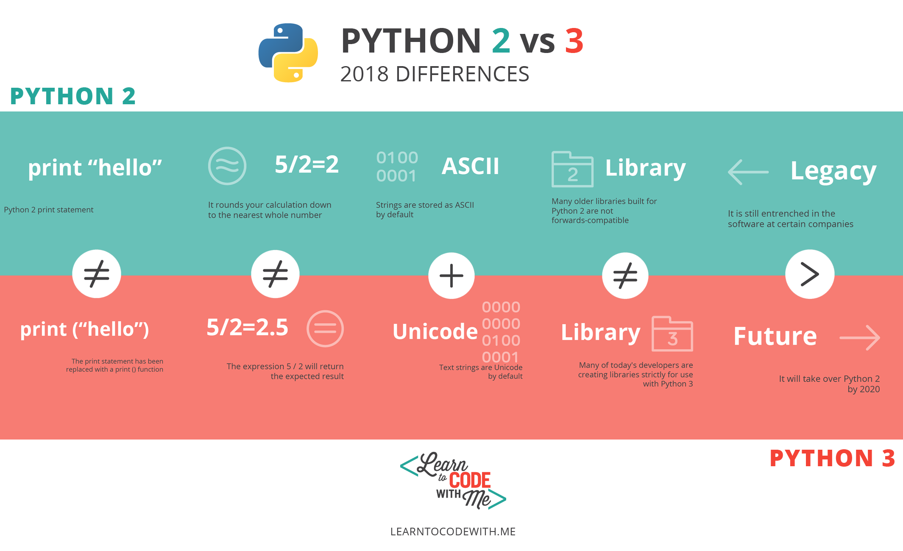

# MiniCurso Python

---

## Roteiro

* Historia e Caracteristicas da Linguagem
* Areas de Aplicação
* Sintaxe básica
* Estrutura de Dados
* Módulos Importantes
* Criação de um WebScrapper

--- 

## História da Linguagem

---

### Guido Van Rossum

--- 

## Python

* Linguagem de propósito geral
* Fácil e Intuitiva
* Multiparadigmas
* Multiplataforma
* Interpretada
* Biblioteca Padrão poderosa
* Open Source

---

## Áreas de Aplicação

* Inteligência Artifical 
* Web
* Automação Residencial

---
	
## Python 2 e 3

---
## Sintaxe Básica

---?code=codigos/tipos.py&lang=python&title=Tipos de Variaveis(Python)

@snap[south span-100 text-08]
@[1](Define uma variável do tipo str)
@[2](Variável do tipo bool)
@[3](Variável do tipo int)
@[4](Variável do tipo float)
@[6](Imprime os tipos das variáveis)
@snapend

---?code=codigos/tipos.c&lang=c&title=Tipos de Variaveis(C)

@snap[south span-100 text-08]
@[3](Define uma variável do tipo str)
@[4](Variável do tipo bool)
@[5](Variável do tipo int)
@[6](Variável do tipo float)
@snapend

+++?code=codigos/ola_mundo.py&lang=python&title=Codigo Ola Mundo Imitando C

@snap[south span-100 text-08]
@[1](Define uma função "Main")
@[2](Printa na tela "Ola Mundo")
@snapend
